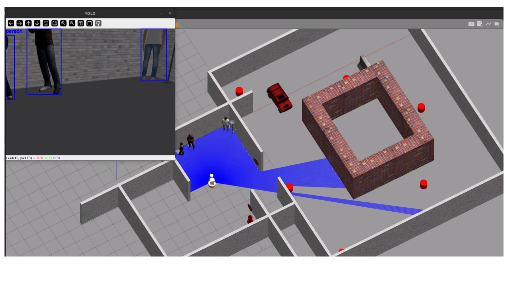
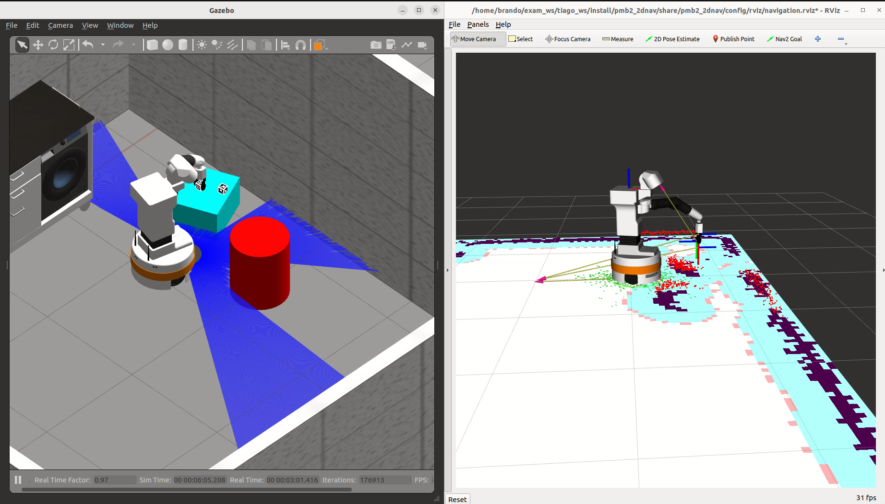
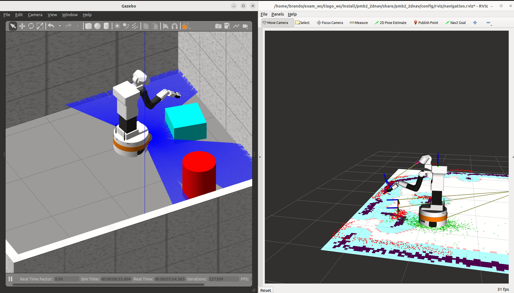
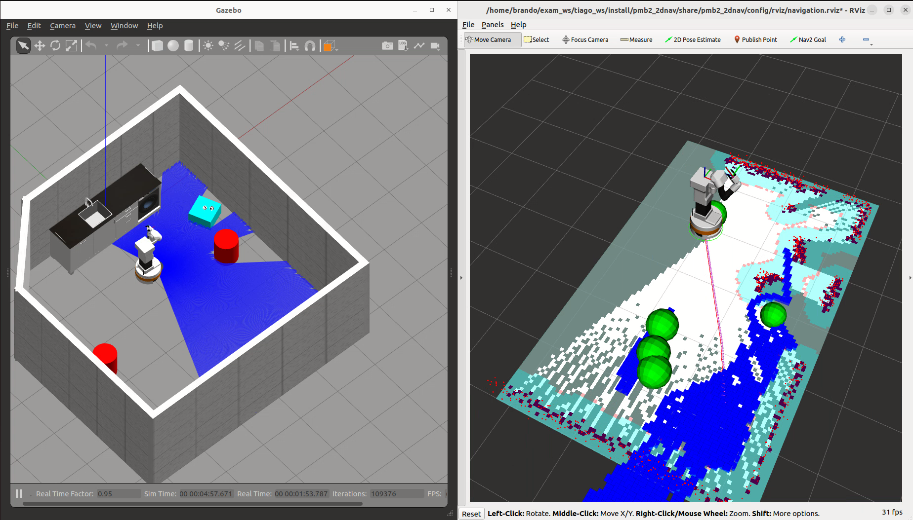
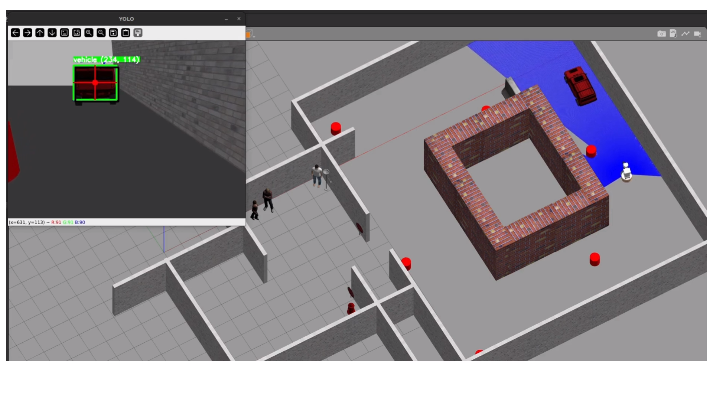

# TIAGo Mobile Manipulation & Tracking

Autonomous mobile manipulation and perception on the PAL **TIAGo** robot, developed across
two graduate robotics courses at the University of Bologna. Two demonstration missions —
ArUco-based pick-and-place and YOLOv5-based moving-target tracking — built on a shared base
of SLAM, Nav2 navigation and frontier exploration. Everything runs in Gazebo simulation; no
deployment on physical hardware.



## Context

Two courses in the M.Sc. in Automation Engineering at the University of Bologna, completed
between March and May 2025:

- **Autonomous and Mobile Robotics** → Mission A (pick & place with ArUco markers)
- **Topic Highlight** → Mission B (moving-target tracking with YOLOv5 and RGB-D)

The two projects share a continuous core team that reused and extended the base navigation
stack across both missions.

## Repository layout

The two projects are kept **separate**, each as its own set of colcon workspaces. There is
no merged workspace — build and run one project at a time.

```
AMR_exam_ws/        # Mission A — mapping + ArUco pick & place
├── ros2_ws/        #   ros2_control, built from source (overlay, v2.35.0)
├── tiago_ws/       #   robot description, Nav2 config, mission packages
└── map/            #   reference map for the pick & place phase

TH_exam_ws/         # Mission B — truck detection, exploration, approach
├── th_ros2_ws/     #   ros2_control, built from source (overlay, v2.35.0)
└── th_tiago_ws/    #   robot + mission packages, YOLOv5 detection

docs/images/        # figures used below
```

Only source is committed; `build/`, `install/` and `log/` are git-ignored and regenerated
locally with `colcon build`.

## Prerequisites

- Ubuntu 22.04, ROS 2 Humble, Gazebo Classic 11, Python 3.10+
- `colcon-common-extensions`

Both projects were developed and tuned against a **from-source build of `ros2_control`**
(v2.35.0), shipped inside each project as `ros2_ws` / `th_ros2_ws`, **not** the Humble Debian
packages. The source `gazebo_ros2_control` / `controller_manager` spawn and manage the
controllers the way these missions expect, so build and source that overlay **first**.

---

## Mission A — Pick & Place with ArUco (`AMR_exam_ws`)

TIAGo maps the environment, then localises on the saved map, navigates to the pick table,
detects an ArUco-tagged cube, grasps it with MoveIt2, transports it and places it. The
mission is a finite-state machine coordinating localisation, navigation, perception and
manipulation.

- ArUco detection and pose estimation, TF-based grasp broadcasting, MoveIt2 arm planning
- Waypoint sequencer reading pick/place goals from text files
- IFRA Link Attacher Gazebo plugin to simulate the grasp
- Custom `autonomous_localization`: seeds AMCL and rotates in place to converge the pose




Demo videos:
- Mapping & exploration (platform): [▶ YouTube](https://youtu.be/VVAOCGYgLD8)
- Full pick & place mission: [▶ YouTube](https://youtu.be/A_fflPVE9fQ)



**Build** (overlay first, then the robot workspace):

```bash
cd AMR_exam_ws
source /opt/ros/humble/setup.bash
( cd ros2_ws  && colcon build --symlink-install --cmake-args -DBUILD_TESTING=OFF )
source ros2_ws/install/setup.bash
( cd tiago_ws && colcon build --symlink-install )
```

**Run** — every terminal first: `source ros2_ws/install/setup.bash && source tiago_ws/install/setup.bash`

- Phase 1, mapping (`state_machine_1`): explores the world and saves the map.
- Phase 2, pick & place (`state_machine_2`): localises on the saved map and runs the mission.

A reference map is provided in `AMR_exam_ws/map/`.

---

## Mission B — Moving-Target Tracking with YOLOv5 (`TH_exam_ws`)

TIAGo explores an unknown world until it detects a target vehicle, then switches to visual
tracking: it centres the target using the bounding-box centroid, estimates distance from the
depth image, and approaches. A finite-state machine sequences exploration → detection →
heading alignment → depth-regulated approach.

- YOLOv5-small on the RGB stream (pre-trained on COCO, no fine-tuning)
- Heading-based visual servoing from the bounding-box centroid
- Distance estimation from the depth image inside the detected box



Demo videos:
- Gazebo view: [▶ YouTube](https://youtu.be/xJVv_cDHjbY)
- RViz view: [▶ YouTube](https://youtu.be/ZggdmfBUpX8)

**Build** (overlay first, then the robot workspace):

```bash
cd TH_exam_ws
source /opt/ros/humble/setup.bash
( cd th_ros2_ws  && colcon build --symlink-install --cmake-args -DBUILD_TESTING=OFF )
source th_ros2_ws/install/setup.bash
( cd th_tiago_ws && colcon build --symlink-install )
```

The YOLOv5-small weights (`yolov5s.pt`) are committed, so the mission runs offline without
fetching them from `torch.hub` on first launch.

---

## Limitations

- Simulation only (Gazebo); never deployed on physical TIAGo hardware.
- The IFRA Link Attacher replaces gripper physics with a kinematic attach/detach, so grasp
  success here does not validate real gripper behaviour.
- YOLOv5 is used pre-trained on COCO with no fine-tuning; detection on the specific Gazebo
  vehicle model is not benchmarked beyond the demo scenarios.

## Team

**Core team (both missions)** — Brando Ulissi, Niccolò Antolini
- **Mission A** (Autonomous and Mobile Robotics) — core team + Giancarlo Raspa
- **Mission B** (Topic Highlight) — core team + Luca Bachetti Spurio

## License

MIT.
